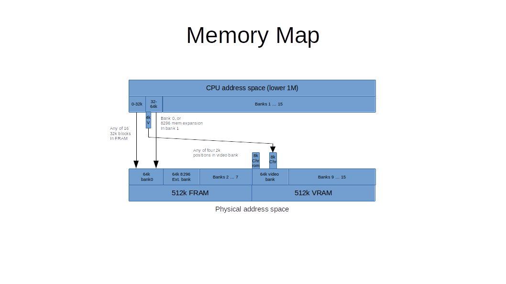
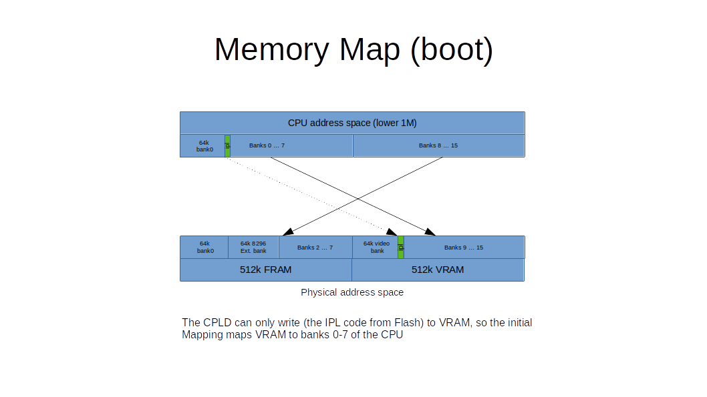

# CPLD code for the MicroPET 1.0

The CPLD is a Xilinx xc95288xl chip, a 5V tolerable CPLD running with 3.3V supply voltage.
I programmed it in VHDL.

## Overview

This is an overview on the register set:

- $e800 (59392)  [Video control](#e800-59392-video-control)
- $e801 (59393)  [Memory map control](#e801-59393-memory-map-control)
- $e802 (59394)  [Low32k bank / video window map](#e802-59394-low32k-bank)
- $e803 (59395)  [Speed control](#e803-59395-speed-control)

- $fff0 (65520)  [8296 memory control (8296 memory map only)](#8296-control-port)

- $e880/e881 (59520/59521) [CRTC emulation](#crtc-emulation)
  - register 9: pixel rows per char - 1
  - register 12: start of video memory high

## Control Ports

### Micro-PET

There are four control ports at $e800 - $e803. They are currently only writable.

#### $e800 (59392) Video Control

- Bit 0: 0= character display, 1= hires display
- Bit 1: 0= 40 column display, 1= 80 column display
- Bit 2: 0= screen character memory in bank 0, 1= character memory only in video bank (see memory map)
- Bit 3: 0= double pixel rows, 1= single pixel rows (also 400 px vertical hires)
- Bit 4: 0= interlace mode (only every second rasterline), 1= duplicate rasterlines
- Bit 5: unused - must be 0
- Bit 6: 0= when switching char height, move vsync to keep screen centered. 1= prevent that
- Bit 7: 0= video enabled; 1= video disabled

##### Screen mirror in bank 0

The CRTC reads its video data from the video bank in VRAM.
This is not mapped to bank 0 in the CPU address space, as it is "slow" memory, because
the available memory bandwidth is shared with the video access.

To allow the PET code to directly write to $8xxx for character video memory, Bit 2 maps
the $8xxx window in CPU bank 0 to the VRAM video bank.

Note that with the register $e802, the position of the video window in the video bank
can be changed (while it stays at $8xxx in the CPU memory bank 0). This allows 
for easy switching between multiple screens beyond the 4k limit of the PET video memory
window at $8xxx.

##### Interlace and 50 row mode

In normal mode (after reset), the VGA video circuit runs in interlace mode,
i.e. only every second raster line is displayed with video data.
Writing a "1" into Video Control register bit 4, interlace is switched off, and every
single line is displayed with video data. 

As long as bit 3 is 0, every rasterline is 
displayed twice, to get to the same height as in interlace mode.
If bit 3 is 1, then every rasterline is a new rasterline.
So, setting bit 3=1 and bit 4=1 gives double the number of character rows
(or raster rows in bitmap mode). I.e. with this you can enable 50 character row
screens.

##### Moving Sync

The character height can be switched between 8 pixel rows and 9 pixel rows (using 
R9 of the emulated CRTC, see below). 
This gives a displayed height of the screen of either 400 or 450 (each rasterline is
displayed twice, see previous section). 

For the video code, the screen starts with the first displayed rasterline. The sync position
is fixed to that position, i.e. it has a fixed rasterline where the vertical sync is triggered.
The value is selected such, that the displayed data is about centered on the screen.

Now, if the character height is changed, the height of the displayed data is changed, and to 
keep the this area vertically centered, the position of the vertical sync in relation to the 
first rasterline is moved. 

However, as there just isn't enough space in the CPLD, when this happens, the distance between
two vertical sync signals changes for one displayed frame. Some monitors may have difficulties
with this, trying to find a new video mode and switching the display off during that search 
attempt. 

In normal operation that does not matter, as this mode should be set once and then left as it is.
But for programs that may switch character height more often, this may be irritating. So,
with bit 6 you can disable moving the vertical sync. The displayed data will stay relatively
high on the screen, and just the lower border moves up and down when the character height is
changed. Then the monitors don't recognize a potential mode change, and thus don't blank
the screen. It just isn't properly centered anymore.

#### $e801 (59393) Memory Map Control

- Bit 0: 0= allow cross-bank access in emulation mode, 1= lock CPU into bank 0 in emulation mode
- Bit 1: 0= normal mode, 1= initial boot mode, swap FRAM and VRAM (see above)
- Bit 2: unused, must be 0
- Bit 3: 0= 8296 mode is disabled / locked ($fff0 disabled); 1= 8296 control port $fff0 enabled
- Bit 4: 0= $009xxx is writable, 1= write protected
- Bit 5: 0= $00Axxx is writable, 1= write protected
- Bit 6: 0= $00Bxxx is writable, 1= write protected
- Bit 7: 0= $00C000-$00FFFF is writable, 1=write protected (except I/O window at $e8xx)

#### $e802 (59394) Bank Control

- Bit 0-3: number of 32k bank in 512k RAM, for the lowest 32k of system
- Bit 4-5: number of 4k character video memory block the $8xxx window points to; possible 
addresses in VRAM bank 0 (CPU bank 8) are $8xxx, $9xxx, $axxx, $bxxx
- Bit 6-7: unused, must be 0

#### $e803 (59395) Speed Control

- Bit 0/1: speed mode
  - 00 = 1 MHz
  - 01 = 2 MHz
  - 10 = 4 MHz
  - 11 = 12.5 MHz with wait states for video access to VRAM
- Bit 2-7: unused, must be 0

### 8296 control port

This write only control port at $fff0 (65520) enables the RAM mapping in the upper 32k of bank 0, as implemented
in the 8296 machine. The address of this port is $FFF0.
To enable it, bit 3 in the Memory Map Control register must be set.

- Bit 0: 0= write enable in $8000-$bfff, 1= write protected
- Bit 1: 0= write enable in $c000-$ffff, 1= write protected
- Bit 2: select one of two block to map for $8000-$bfff (starts either $010000 or $018000)
- Bit 3: select one of two block to map for $c000-$ffff (starts either $014000 or $01c000)
- Bit 4: - unused, must be 0 -
- Bit 5: 0= RAM in $8xxx, 1= screen peek-through the mapped RAM
- Bit 6: 0= RAM in $e8xx, 1= I/O peek-through the mapped RAM
- Bit 7: 0= RAM mapping disabled, 1=enabled

## CRTC emulation

The Video code (partially) emulates only a subset of the CRTC registers:

- Register 9: number of pixel rows per character -1
- Register 12: start of video memory high

All the other registers are not emulated, so any program or demo that
uses them will fail.

As usual with the CRTC, you have to write the register number to $e880 (59520),
the write the value to write to the register to $e881 (59521).

### Video memory mapping

The video memory is defined as follows:

#### Character mode

In character mode (see control port below) two memory areas are used:

1. Character memory and
2. Character pixel data (usually "character ROM")

Register 12 is used as follows:

- Bit 0: - unused - must be 0
- Bit 1: - unused - must be 0
- Bit 2: A10 of start of character memory
- Bit 3: A11 of start of character memory 
- Bit 4: A12 of start of character memory
- Bit 5: A13 of start of character memory
- Bit 6: A13 of character pixel data (charrom)
- Bit 7: A14 of character pixel data (charrom)

As you can see, the character memory can be mapped in 1024 byte pages.
14/15 of character memory address are set to %10, so character memory
starts at $8000 in the video bank, and reaches up to $bfff

For 40 column mode this means 16 screen pages, or 8 screen pages in 80 column mode.
Character memory is mapped to bank 0 at boot, but can be unmapped and only be available in bank 8 (VRAM) using the control port

The character set is 8k in size: two character sets of 4k each, switchable with the 
VIA I/O pin given to the CRTC as in the PET. Register 12 can be used to select
one of 4 such 8k sets. Note that each character occupies 16 bytes (not 8 as in the typical
Commodore character set), so the 9th rasterline for a character may be used.
Character set data is mapped to the lower half of bank 8 (VRAM bank 0, i.e. A15=0).

#### Hires mode

Hires mode is available in 40 as well as 80 "column" mode, i.e. either 320x200 or 640x200 pixels.

Register 12 here is used as follows:

- Bit 0: - unused - must be 0
- Bit 1: - unused - must be 0
- Bit 2: A10 of start of hires data
- Bit 3: A11 of start of hires data
- Bit 4: A12 of start of hires data
- Bit 5: A13 of start of hires data
- Bit 6: A14 of start of hires data
- Bit 7: A15 of start of hires data

## Memory Map

The memory map looks as follows. There are 512k "Fast" RAM
that make up banks 0-7, and 512k "Video" RAM that make up banks 8-15.

### Standard Map

This map describes the standard memory map, that is enabled after the
SPI boot code has executed and initiated the memory map.

RAM bank 8 is the "video" bank in that hires graphics and character ROMs 
are mapped here. The character data is be mapped there as well but can be
mapped for writing to bank 0 using bit 2
of the control register (see below).

RAM bank 1 is the one used for the 8296 RAM extension (that is mapped into the
upper 32k of bank 0 when the 8296 control register at $fff0 is set.

    Video   +----+ $100000
    RAM     |    |         VRAM 
            |    |         bank 15 
            +----+ $0f0000
            |    |
             ...
            |    |
            +----+ $090000
            |    |         VRAM
            |    |	   bank 8 (video)
            +----+ $080000
    Fast    |    |         FRAM
    RAM     |    |         bank 7
            +----+ $070000
            |    |
             ...
            |    |
            +----+ $020000
            |    |         FRAM
            |    |         bank 1 (8296 mapped memory)
            +----+ $010000
            |    |         FRAM (PET ROM / I/O / 4k Video mapped from VRAM) $8000-$ffff
            |    |         FRAM (lower 32k)
            +----+ $000000

### Init Map

When the CPU boots, it tries to do so from bank 0. Here we have RAM, so we have to provide some 
initial mapping.

The problem here is that the CPU boots from bank 0, but the CPLD can only
write to Video RAM. So, the boot code from the SPI Flash can only be written
into Video RAM to boot the CPU. Therefore, a bit in the control register
switches the two RAM areas. On hardware reset the Video RAM is mapped to 
banks 0-7 and Fast RAM to banks 8-15. 

The first thing the boot code does is to copy itself to Fast RAM, and
switch over the two RAM chips.

### Video Map

#### Character memory

The following diagram describes the way that the character video memory is addressed.

             Video    +----+ $090000
             BANK     |    |        
                      |    |	 
                      |    |	 
                      +----+ $08e000	 
     CPU              |    |	 
     Bank 0           |    |
       |              |    |	 
       |              +----+ $08c000
       |      /---->  |    |	BCtrl 4/5 -> 11 / CRTC12 -> $30
     $9000    |       +----+ $08b000
       | -----+---->  |    |	BCtrl 4/5 -> 10 / CRTC12 -> $20
     $8000    |       +----+ $08a000
       |      |\--->  |    |	BCtrl 4/5 -> 01 / CRTC12 -> $10
       |      |       +----+ $089000
       |      \---->  |    |	BCtrl 4/5 -> 00 / CRTC12 -> $00
       |              +----+ $088000
       |              |    |	 
                      |    |	 
                      |    |	 
                      +----+ $088000	 
                      |    |	 
                      |    |	 
                      |    |	 
                      +----+ $086000	 
                      |    |	 
                      |    |	 
                      |    |	 
                      +----+ $084000	 
                      |    |	 
                      |    |	 
                      |    |	 
                      +----+ $082000	 
                      |    |	 
                      |    |	 
                      |    |	 
                      +----+ $080000

       
Using the Bank control register, the $8xxx window in bank 0 (if enabled via Video control
register), maps to one of four 4k blocks in the video RAM. 
The four blocks start at $088000, $08a000, $08b000, and $08c000 repectively.

At the same time CRTC register 12 can be used to fetch the video data from 
any of the blocks starting at 1k boundaries from $088000 ... $08cc00.

This way one character video block can be mapped to CPU bank 0, while the CRTC
fetches its video output data from another video output block.
This can be used to implement double buffering, or even multiple virtual
"machines" 

#### Character generator memory

The following diagram describes the way that the char generator memory is addressed.
The Character generator memory is the memory that holds the pixel data for each character.
Each character has 16 consecutive bytes, so that the maximum of 9 pixel rows per
character can be handled. As a character has 16 bytes, a character set of 256 characters
has a character generator of 4k.

The Bank Control register allows to select 4 blocks of 8k for the character generator memory,
located at the lower half of the Video Bank 8.
In each 8k, there are two sets of character generators, of 4k each. The one to use is selected by the
VIA CA2 output pin as on the PET.

       Video    +----+ $090000
       BANK     |    |        
                |    |	 
                |    |	 
                +----+ $08e000	 
                |    |	 
                |    |
                |    |	 
                +----+ $08c000
                |    |
                |    |
                |    |
                +----+ $08a000
                |    |	 
                |    |
                |    |	 
                +----+ $088000	 
                |    |	      CRTC12.6/7 -> 11, VIA CA2=1 
                +----+ $087000	 
                |    |	      CRTC12.6/7 -> 11, VIA CA2=0 
                +----+ $086000	 
                |    |	      CRTC12.6/7 -> 10, VIA CA2=1 
                +----+ $085000	 
                |    |	      CRTC12.6/7 -> 10, VIA CA2=0
                +----+ $084000	 
                |    |	      CRTC12.6/7 -> 01, VIA CA2=1
                +----+ $083000	 
                |    |	      CRTC12.6/7 -> 01, VIA CA2=0
                +----+ $082000	 
                |    |	      CRTC12.6/7 -> 00, VIA CA2=1
                +----+ $081000	 
                |    |	      CRTC12.6/7 -> 00, VIA CA2=0
                +----+ $080000
        

## Code

The code contains three modules:

- Video.vhd: the video controller part
- Clock.vhd: clock generation
- Mapper.vhd: memory mapping
- Top.vhd: glue logic and timing
- Spi.vhd: SPI module

- pinout.ucf: Pinout definition

## Build

The VHDL code is compiled using the latest version of WebISE that still supports the xc95xxx chips, i.e. version 14.7.
It can still be downloaded from the Xilinx website.

For more information on the setup, see the [build file](Build.md).

