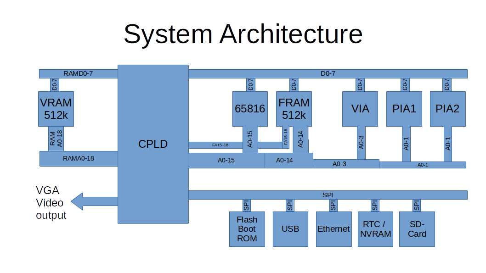
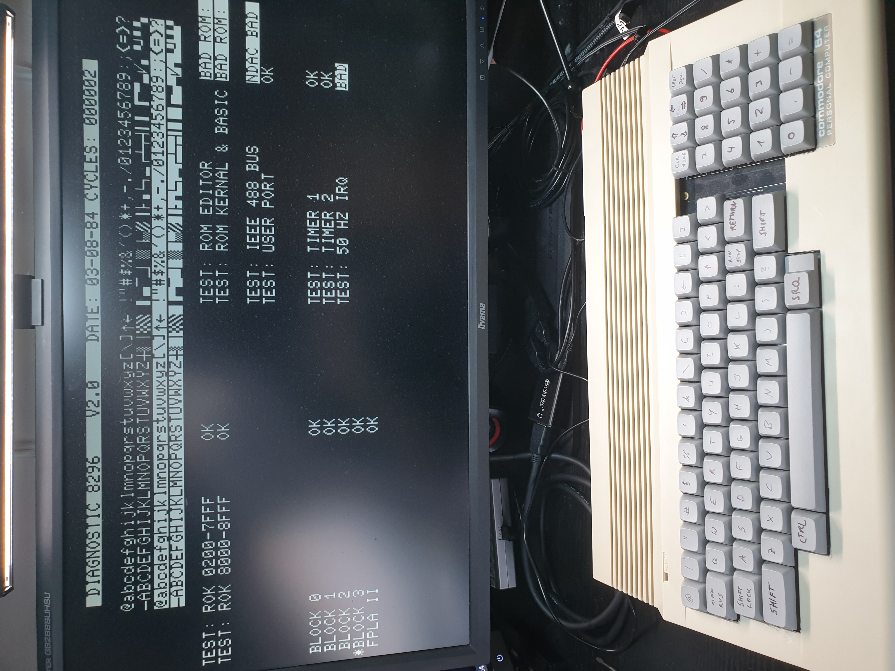

# uPET R2

This is a re-incarnation of the Commodore PET computer(s) from the later 1970s.

It is build on a Eurocard board and has only parts that can still be obtained new in 2021.
The current version is 2.0B.

Some videos on the build process can be found here [YT 8-bit times](https://youtube.com/playlist?list=PLi1dzy7kw1iybjcUccgjCV4fhNH4IPWSx)

## Features

The board is built with a number of potential features, not all of them have been implemented at this time.

- Commodore 3032 / 4032 / 8032 / 8296 with options menu to select at boot
  - Boot-menu to select different PET versions to run
  - 40 col character display
  - 80 col character display
  - 8296 memory map emulation
  - IEEE488 interface (card edge)
  - Tape connector (card edge)
  - PET graphics keyboard, or alternatively a C64 keyboard
- Improved system design:
  - 512k video RAM, 512k fast RAM accessible using banks on the W65816 CPU
  - boot from an SPI Flash ROM
  - up to 12.5 MHz mode (via configuration register)
  - VGA b/w video output
  - Write protection for the PET ROMs once copied to RAM
  - lower 32k RAM mappable from all of the 512k fast RAM
- Improved Video output:
  - Hires graphics mode (using a configuration register)
  - modifyable character set
  - 40/80 column display switchable
  - 25/50 rows display switch
  - multiple video pages mappable to $8000 video mem address

## Overview

The system architecture is actually rather simple, as you can see in the following graphics.

The main functionality is "hidden" inside the CPLD. It does:

1. clock generation and management
2. memory mapping
3. video generation.
4. SPI interface and boot

On the CPU side of the CPLD it is actually a rather almost normal 65816 computer, 
with the exception that the bank register (that catches and stores the address lines 
A16-23 from the CPU's data bus) is in the CPLD, and that there is no ROM. The ROM has been
replaced with some code in the CPLD that copies the initial program to the CPU accessible
RAM, taking it from the Flash Boot ROM via SPI. This actually simplifies the design,
as 

1. parallel ROMs are getting harder to come by and
2. they are typically not as fast as is needed, and
3. with the SPI boot they don't occupy valuable CPU address space.

The video generation is done using time-sharing access to the video RAM.
The VGA output is 640x480 at 60Hz. So there is a 40ns slot per pixel on the screen, 
with a pixel clock of 25MHz.

The system runs at 12.5MHz, so a byte of pixel output (i.e. eight pixels) has four
memory accesses to VRAM. Two of them are reserved for video access, one for fetching the
character data (e.g. at $08xxx in the PET), and the second one to fetch the "character ROM"
data, i.e. the pixel data for a character. This is also stored in VRAM, and is being loaded
there from the Flash Boot ROM by the initial boot loader.

The CPLD reads the character data, stores it to fetch the character pixel data, and streams
that out using its internal video shift register.

For more detailled descriptions of the features and how to use them, pls see the subdirectory,
as described in the next section.

## Building

Here are four subdirectories:

- [Board](Board/) that contains the board schematics and layout
- [CPLD](CPLD/) contains the VHDL code to program the CPLD logic chip used, and describes the configuration options
- [ROM](ROM/) ROM contents to boot
- [Case](Case/) 3-D printed supports and keyboards to mount board in a C64c case

### Board

To build the board, you have to find a provider that builds PCBs from Eagle .brd files.
Currently no gerbers are provided.

### CPLD

The CPLD is a Xilinx xc95288xl programmable logic chip. It runs on 3.3V, but is 5V tolerant,
so can be directly connected to 5V TTL chips. I programmed it in VHDL.

Unfortunately the W65xx parts are "only" CMOS, and not TTL input chips - but 3.3V is still above
the VCC/2 for the 5V chips. Only Phi2 needs improvements on the signal quality using a pull-up resistor
and specific VHDL programming.

### ROM

The ROM image can be built using gcc, xa65, and make. Use your favourite EPROM programmer to burn it into the SPI Flash chip.

Two options are provided:

1. An original ROM version that boots into the original editor ROMs
2. Updated editor ROMs from [Steve's Editor ROM project](http://www.6502.org/users/sjgray/projects/editrom/index.html) that can optionally handle C64 keyboards, has a DOS wedge included, and resets into the Micro-PET boot menu

## Future Plans

These are future expansions I want to look into. Not all may be possible to implement.

- n/a

## Gallery

 
